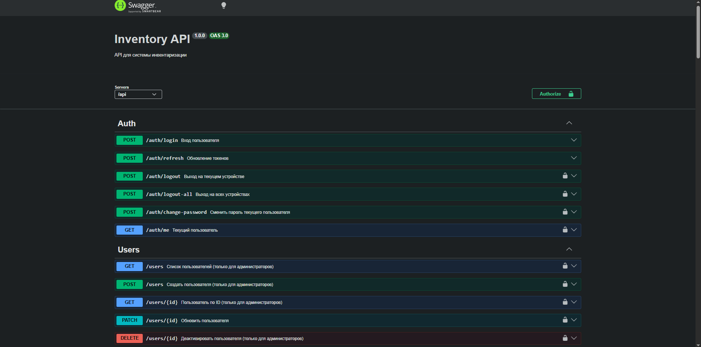
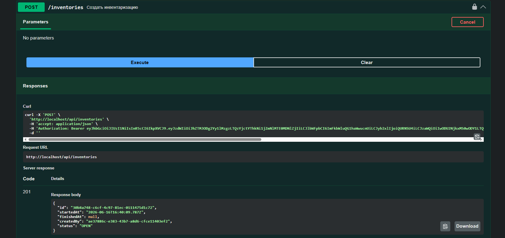
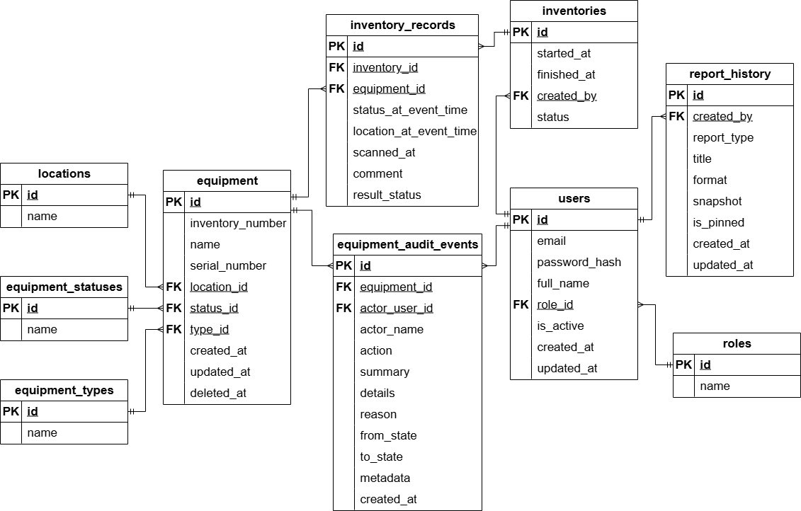
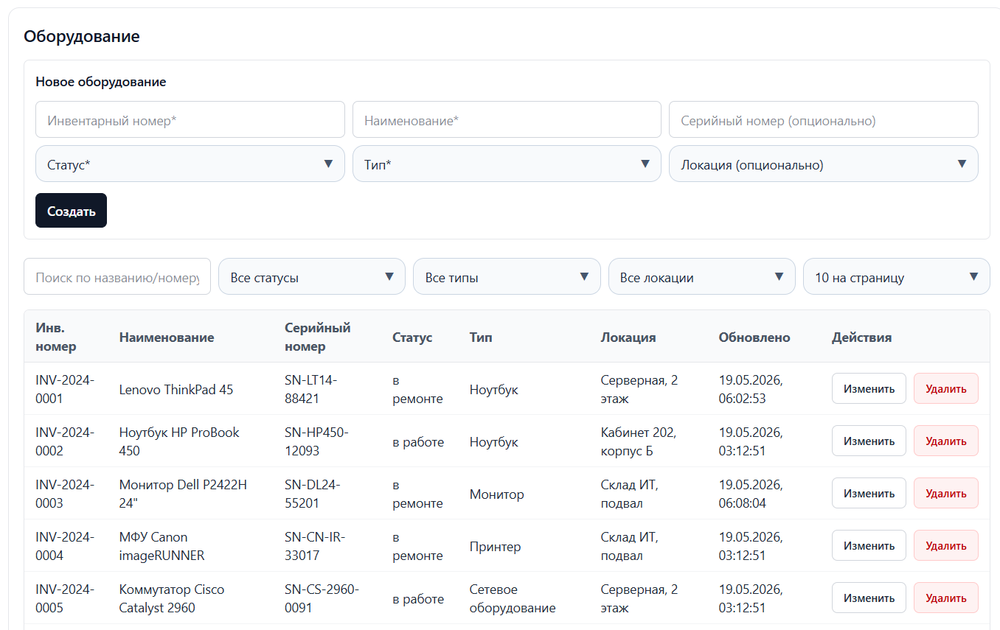
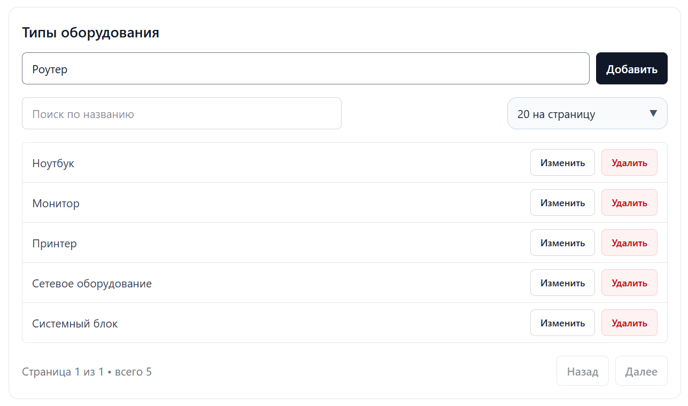
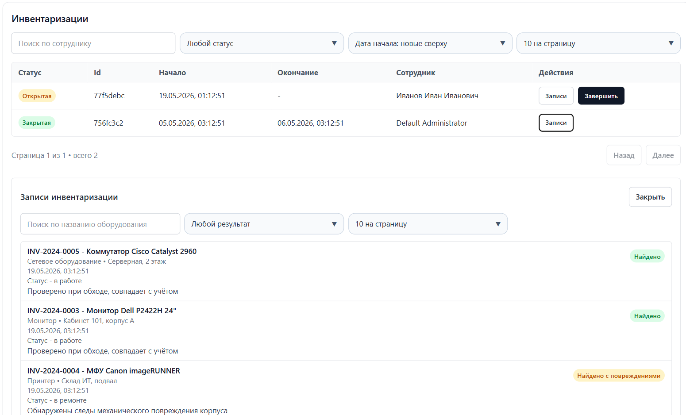
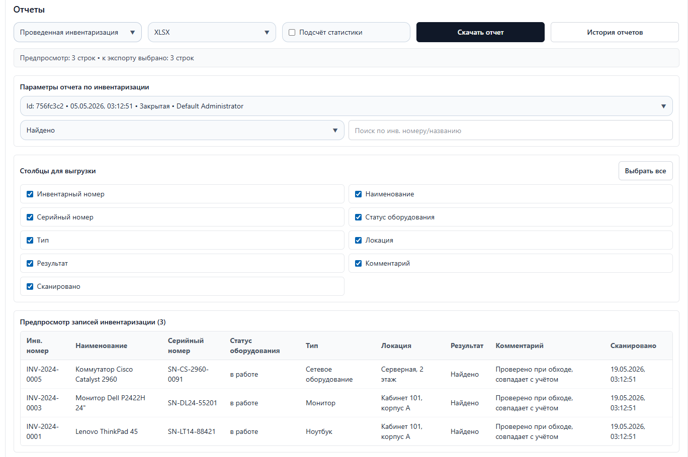
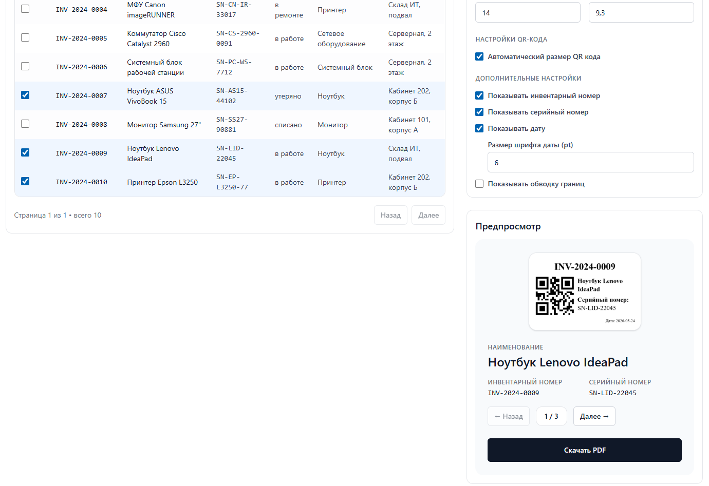
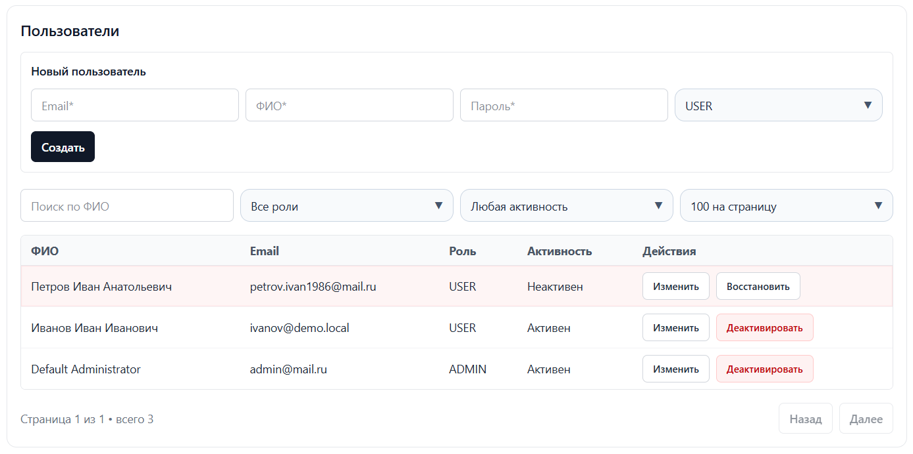

<p align="center">
  
</p>

<h1 align="center">Серверная часть и веб-интерфейс системы инвентаризации оборудования с использованием QR-кодов</h1>

<p align="center">
  <a href="https://nestjs.com/" target="_blank" rel="noreferrer">
    
  </a>
  <a href="https://react.dev/" target="_blank" rel="noreferrer">
    
  </a>
  <a href="https://vite.dev/" target="_blank" rel="noreferrer">
    
  </a>
  <a href="https://www.typescriptlang.org/" target="_blank" rel="noreferrer">
    
  </a>
  <a href="https://www.postgresql.org/" target="_blank" rel="noreferrer">
    
  </a>
  <a href="https://redis.io/" target="_blank" rel="noreferrer">
    
  </a>
  <a href="https://nginx.org/" target="_blank" rel="noreferrer">
    
  </a>
  <a href="https://www.docker.com/" target="_blank" rel="noreferrer">
    
  </a>
  <a href="https://swagger.io/" target="_blank" rel="noreferrer">
    
  </a>
</p>

## О проекте

Это подсистема комплекса программных средств для инвентаризации оборудования, состоящая из серверной части на NestJS и веб-интерфейса на React

Основные задачи подсистемы:

- учет оборудования и его состояния
- аудит действий с оборудованием
- проведение инвентаризаций через сканирование QR-кодов
- работа со справочниками и пользователями
- формирование и хранение истории отчетов

## Серверная часть

| Контроллер | Назначение |
| --- | --- |
| AuthController | Вход, refresh токены, logout/logout-all, профиль и смена пароля |
| UsersController | Управление пользователями и ролями |
| EquipmentController | Работа с оборудованием и таймлайном изменений |
| InventoriesController | Создание, просмотр и закрытие инвентаризаций |
| InventoryRecordsController | Записи сканирования в рамках инвентаризационной сессии |
| EquipmentTypesController | Управление справочником типов оборудования |
| EquipmentStatusesController | Управление справочником статусов оборудования |
| LocationsController | Управление справочником локаций |
| ReportsController | Формирование и история отчетов |
| DiscoveryController | Обнаружение сервера в локальной сети |

### Архитектурно

- Модульная структура NestJS по функциональным зонам
- JWT access/refresh модель авторизации
- Ролевой доступ для разграничения прав
- Централизованное логирование аудита действий с оборудованием

## Swagger

Swagger — документация API с описанием REST-эндпоинтов и DTO

<p align="center">
  
  
</p>

## База данных

Основная база данных PostgreSQL содержит пользователей, роли, оборудование, справочники, инвентаризации, результаты сканирования, историю отчетов и аудит изменений

<p align="center">
  
</p>

### Таблицы БД

| Таблица | Назначение |
| --- | --- |
| roles | Роли пользователей |
| users | Пользователи системы |
| locations | Справочник локаций |
| equipment_statuses | Справочник статусов оборудования |
| equipment_types | Справочник типов оборудования |
| equipment | Карточки оборудования |
| inventories | Сессии инвентаризации |
| inventory_records | Результаты сканирования в инвентаризации |
| report_history | История сформированных отчетов |
| equipment_audit_events | Журнал аудита событий по оборудованию |

## Redis

Redis связан с модулем авторизации и используется как слой управления сессиями и токенами

| Ключ | Значение | Назначение |
| --- | --- | --- |
| `refresh:userId:sessionId` | refresh token | Refresh-токен конкретной сессии пользователя |
| `sessions:userId` | set из sessionId | Набор активных сессий пользователя |
| `authv:userId` | integer | Версия токенов для logout-all |
| `bl:access:jti` | `1` | Access-токен в blacklist после logout |
| `refresh:userId` | refresh token | Legacy-ключ обратной совместимости |

## Веб-интерфейс

Веб-панель закрывает весь рабочий цикл пользователя: от ведения учета оборудования и просмотра инвентаризаций до формирования отчетов и печати QR-этикеток

Функционально:

- управление оборудованием и его жизненным циклом
- просмотр открытых и завершенных инвентаризаций
- управление пользователями и ролями
- работа со справочниками
- генерация QR-этикеток
- просмотр и экспорт отчетов

Технически:

- React Router для маршрутизации
- React Query для серверного состояния и кэширования
- централизованный API-клиент на Axios с refresh-логикой

<p align="center">
  
  
  
  
  
  
</p>

## Локальный запуск

### 1. Клонировать репозиторий

```bash
git clone https://github.com/NekitBST/inventory_server.git
cd inventory_server
```

### 2. Подготовить конфиг окружения

Создать `.env` на базе `.env.example` и заполнить необходимые переменные

### 3. Запустить сервер

```bash
npm install
npm run migrate:up
npm run start
```

Swagger после запуска:

```text
http://localhost:{port}/swagger
```

### 4. Запустить веб-панель

```bash
cd web-panel
npm install
npm run dev
```

## Запуск в Docker

### 1. Подготовить конфиг окружения

Создать `.env` на базе `.env.example` и заполнить необходимые переменные

### 2. Поднять базу, Redis, API, web-панель и Nginx

```bash
docker compose -f docker-compose.postgres.yml -f docker-compose.redis.yml -f docker-compose.yml up --build -d
```

### 3. Применить миграции внутри API-контейнера

```bash
docker compose exec api npm run migrate:up
```